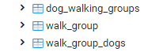

# 1 tot meer relatie
## Doel
Laten zien hoe een 1 tot meer relatie als tabel in de database komt. De domeinklasse zijn gemaakt met behulp van JPA 
binnen het Spring-boot framework.

Deze branch is een uitbreiding op de master-branch en laat ook een N tot N of (ManyToMany) relatie zien.


## Bidirectioneel
Birectioneel betekent dat je aan beide kanten van de relatie weet wie erbij hoort. In dit geval kun je er via het 
Dog-object achterkomen wie de eigenaar is, maar je kunt ook via de eigenaar erachter komen welke honden deze heeft.

Dit voorbeeld bevat de domein-klassen ApplicationUser en Dog.
Een ApplicationUser kan 0 tot N honden hebben. Een hond kan maar één baasje (ApplicationUser) hebben.

De domeinklassen zijn zo opgebouwd dat als je een dog-instantie uit de database ophaalt dat je dan een dog-object met 
een ApplicationUser-object krijgt, mits de hond een eigenaar heeft.

Wanneer je een ApplicationUser-instantie ophaalt uit de database, dan maakt Spring daar een ApplicationUser-object van 
en voegt, mits de gebruikers honden heeft, deze ook toe aan het object.

## Many to Many
Aan deze branch is de klasse WalkGroup toegevoegd. Een hond kan bij meerdere WalkGroup-en horen en een WalkGroup bevat
meerdere honden. Bekijk de klasses voor extra uitleg. Een van de twee klasses moet onderstaande annotatie hebben. 
Gebeurt dat niet dan worden er door JPA twee koppeltabellen in de databse aangemaakt.
```
@ManyToMany(mappedBy = "dogs")
```


## Aanpassingen om werkend te krijgen
in src/main/resources/application.properties dien je de gegevens aan te passen naar jouw postgresql database.
 * Verander example op regel twee naar de naam van jouw database (standaard: postgres)
 * Verander de username naar jouw username op regel 3 (standaard postgres)
 * Verander het wachtwoord op regel 4.
 
## Code runnen
Start PGAdmin op. Als je bovenstaande aanpassing hebt gedaan, kun je de code runnen met het volgende commando:
```
mvnw spring-boot:run
```

Daarna kun je de database bezoeken op: http://127.0.0.1:51693/browser/
Ga naar de tabellen in de door jou gekozen database. Daar zou je de volgende twee moeten zien:
 * application_user (user_id, email en name)
 * dog(id, fur_colour, is_female, name, species, owner_id)

Bij constraints zou je de volgende moeten zien bij dog:
 * dog_pkey
 * fk + gegenereerd mumbo jumbo. Druk rechts op SQL om de SQL van de constraint te checken
```
-- Constraint: fkb1fgtalx2cmqcrrjn2kb071gk

-- ALTER TABLE public.dog DROP CONSTRAINT fkb1fgtalx2cmqcrrjn2kb071gk;

ALTER TABLE public.dog
    ADD CONSTRAINT fkb1fgtalx2cmqcrrjn2kb071gk FOREIGN KEY (owner_id)
    REFERENCES public.application_user (user_id) MATCH SIMPLE
    ON UPDATE NO ACTION
    ON DELETE NO ACTION;
```